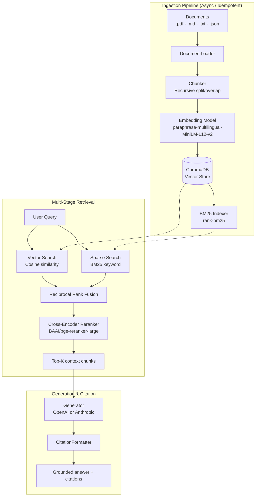
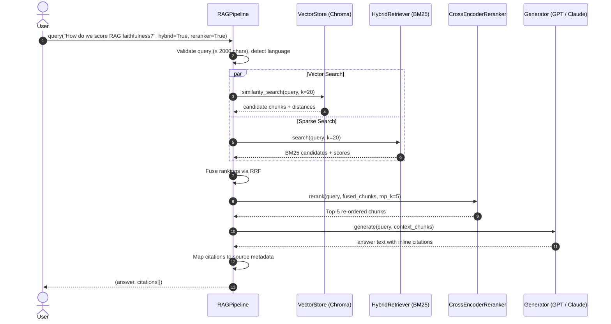
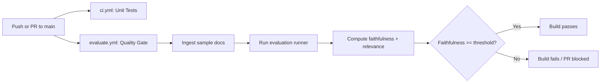

# Production-Grade RAG Pipeline

A modular, test-driven Retrieval-Augmented Generation (RAG) pipeline built in three progressive phases — from a working baseline to hybrid search, cross-encoder re-ranking, and automated evaluation quality gates.

---

<div align="center">

[](https://www.python.org/)
[](#running-tests)
[](LICENSE)
[](https://github.com/astral-sh/ruff)
[](#configuration)

[Why This Project](#why-this-project) •
[Architecture](#architecture) •
[Phases](#phases) •
[Getting Started](#getting-started) •
[CLI](#cli) •
[API](#api) •
[Configuration](#configuration) •
[Testing](#testing) •
[Contributing](#contributing)

</div>

---

## Why This Project

Most RAG tutorials end with a basic notebook: embed a few strings, ask an LLM a question, done. Production RAG pipelines face real challenges: **noisy document ingestion, retrieval drift, hallucinations, performance regressions,** and the need to statistically prove quality remains stable over time.

This project is a blueprint for a production-ready RAG system, structured in three progressive phases:

- **Phase 1 — Foundation**: Document loading, structure-aware chunking, vector embedding, and source-grounded generation with citation formatting.
- **Phase 2 — Retrieval Optimization**: Hybrid search (BM25 sparse + dense vector) fused via Reciprocal Rank Fusion (RRF), followed by Cross-Encoder re-ranking.
- **Phase 3 — Quality Gates**: LLM-as-Judge evaluation (faithfulness and relevance) against a golden dataset, integrated into GitHub Actions to block regressions automatically.

---

## Architecture

The pipeline separates each concern into independent modules coordinated by a single `RAGPipeline` orchestrator.

### Ingestion and Query Flows



### Query Sequence



---

## Phases

```
  ┌──────────────────────────────────────────────────────┐
  │ Phase 1 — Foundational Pipeline                      │
  │  · pypdf / TXT / MD / JSON loaders                   │
  │  · SentenceTransformers (multilingual MiniLM-L12)    │
  │  · ChromaDB local vector store                       │
  │  · OpenAI / Anthropic generator + citations          │
  └──────────────────────┬───────────────────────────────┘
                         │
                         ▼
  ┌──────────────────────────────────────────────────────┐
  │ Phase 2 — Retrieval Optimization                     │
  │  · BM25 sparse search                                │
  │  · Reciprocal Rank Fusion (RRF)                      │
  │  · Cross-Encoder re-ranking (BAAI/bge-reranker-large)│
  └──────────────────────┬───────────────────────────────┘
                         │
                         ▼
  ┌──────────────────────────────────────────────────────┐
  │ Phase 3 — Evaluation & CI Quality Gate               │
  │  · Golden Q&A dataset                                │
  │  · LLM-as-Judge: faithfulness + answer relevance     │
  │  · GitHub Actions regression gate                    │
  └──────────────────────────────────────────────────────┘
```

---

## Deep Dive

### Phase 1 — Foundation

**Structure-aware chunking**: The `Chunker` splits documents recursively on paragraph boundaries (`\n\s*\n`), then sentences, then characters. This prevents mid-sentence cuts while maximising semantic context per chunk (`chunk_size=800`, `chunk_overlap=150`).

**Idempotent indexing**: Every chunk receives a deterministic MD5 ID derived from its document path, chunk index, and content prefix. Re-ingesting the same file overwrites existing chunks rather than duplicating them.

**Language-aware routing**: Documents and queries are automatically language-detected (English, German, Spanish). Each language gets its own ChromaDB collection so multilingual corpora stay separate.

**Strict source attribution**: The LLM is instructed to answer only from the injected context and append bracketed references. `CitationFormatter` maps those references back to filename, path, and retrieval score.

### Phase 2 — Hybrid Search & Re-ranking

**Reciprocal Rank Fusion** merges vector and BM25 rankings without requiring score calibration:

$$RRF(d) = \alpha \cdot \frac{1}{k_{rrf} + r_{vec}(d)} + (1-\alpha) \cdot \frac{1}{k_{rrf} + r_{bm25}(d)}$$

where $k_{rrf}=60$ smooths rank sensitivity and $\alpha=0.6$ weights the vector side by default.

**Cross-Encoder re-ranking**: The bi-encoder retrieves candidates efficiently; the Cross-Encoder (`BAAI/bge-reranker-large`) then jointly encodes every query-chunk pair for high-accuracy reordering before the context window is filled.

### Phase 3 — Evaluation & CI

**LLM-as-Judge** evaluates two dimensions per answer:
- **Faithfulness**: are all claims in the answer grounded by the retrieved context? (detects hallucinations)
- **Answer Relevance**: does the answer actually address the question?

**Quality gate**: the evaluation script exits with code `1` when average faithfulness falls below `RAG_FAITHFULNESS_THRESHOLD` (default `0.7`), blocking the GitHub Actions build and posting a summary table on the pull request.

---

## Getting Started

### Prerequisites

- Python 3.11 or 3.12
- An OpenAI API key (or Anthropic API key)

### Installation

```bash
git clone https://github.com/Ashok007-cmd/production-grade-rag.git
cd production-grade-rag

python3 -m venv .venv
source .venv/bin/activate

pip install -r requirements.txt

cp .env.example .env
# Edit .env and fill in your API keys
```

---

## CLI

All scripts must be run as modules from the project root so `src` resolves correctly.

### Ingest documents

```bash
python -m scripts.ingest --source data/sample_docs --reset
```

| Flag | Description |
|------|-------------|
| `--source` | Path to a file or directory |
| `--reset` | Clear the collection before ingesting |

### Query the pipeline

```bash
python -m scripts.query --question "What is hybrid search?" --hybrid --reranker
```

| Flag | Description |
|------|-------------|
| `-q / --question` | Your query |
| `--hybrid` | Enable BM25 + vector hybrid search |
| `--reranker` | Apply Cross-Encoder re-ranking |
| `--provider` | LLM override: `openai` or `anthropic` |

**Example output:**

```
============================================================
ANSWER
============================================================
Hybrid search fuses dense semantic vectors and sparse lexical search (BM25)
using Reciprocal Rank Fusion (RRF) [1]. This ensures the system catches both
conceptual synonyms and exact keywords [1][2]. The fused list is then re-ranked
by a Cross-Encoder to maximise precision [2].

============================================================
SOURCES
============================================================
[1] hybrid_search.txt (score: 0.0322)
    Source: data/sample_docs/hybrid_search.txt

[2] reranker.txt (score: 0.7842)
    Source: data/sample_docs/reranker.txt
============================================================
```

### Evaluate

```bash
# Create sample golden dataset (first run only)
python -m scripts.evaluate --create-sample-dataset

# Run with quality gate
python -m scripts.evaluate --hybrid --reranker --fail-on-threshold
```

| Flag | Description |
|------|-------------|
| `--fail-on-threshold` | Exit 1 if faithfulness falls below threshold |
| `--threshold` | Override the faithfulness threshold (e.g. `0.75`) |
| `--export-ci-summary` | Write `eval-summary.json` for CI consumption |

---

## API

Run as a long-lived FastAPI service to keep embedding models warm:

```bash
uvicorn src.api.app:app --reload
```

| Method | Path | Description |
|--------|------|-------------|
| GET | `/healthz` | Liveness check (no model loading) |
| GET | `/readyz` | Readiness probe — warms up all models |
| GET | `/stats` | Pipeline statistics |
| POST | `/ingest` | Ingest documents from a path inside `data/` |
| POST | `/query` | Answer a question with citations |

```bash
# Liveness
curl http://localhost:8000/healthz

# Ingest (path must be within the configured data directory)
curl -X POST http://localhost:8000/ingest \
  -H "Content-Type: application/json" \
  -d '{"source": "data/sample_docs", "reset": false}'

# Query
curl -X POST http://localhost:8000/query \
  -H "Content-Type: application/json" \
  -d '{"question": "What is RAG?", "use_hybrid": true, "use_reranker": true}'
```

Interactive docs: `http://localhost:8000/docs`

### Docker Compose

```bash
# Copy and configure env
cp .env.example .env
# Edit .env with your keys

docker compose up --build
```

The Compose stack starts ChromaDB on port `8001` and the API on port `8000`.

---

## Configuration

All settings use the `RAG_` prefix and can be set in `.env` or as environment variables.

| Variable | Type | Default | Description |
|----------|------|---------|-------------|
| `RAG_LLM_PROVIDER` | str | `openai` | `openai` or `anthropic` |
| `RAG_LLM_MODEL` | str | `gpt-4o-mini` | Generation model name |
| `RAG_DATA_DIR` | str | `data` | Base directory for documents and datasets |
| `RAG_CHROMA_PATH` | str | `data/chroma_db` | ChromaDB persistence directory |
| `RAG_CHROMA_HOST` | str | `None` | Remote ChromaDB host |
| `RAG_CHROMA_PORT` | int | `None` | Remote ChromaDB port |
| `RAG_EMBEDDING_MODEL` | str | `paraphrase-multilingual-MiniLM-L12-v2` | SentenceTransformers embedding model |
| `RAG_CHUNK_SIZE` | int | `800` | Target characters per chunk |
| `RAG_CHUNK_OVERLAP` | int | `150` | Overlap characters between chunks |
| `RAG_TOP_K_RETRIEVAL` | int | `20` | Stage-1 candidate count |
| `RAG_TOP_K_FINAL` | int | `5` | Final chunks sent to the LLM |
| `RAG_HYBRID_ALPHA` | float | `0.6` | Vector weight in RRF (1.0 = pure vector) |
| `RAG_RRF_K` | int | `60` | RRF smoothing constant |
| `RAG_RERANKER_MODEL` | str | `BAAI/bge-reranker-large` | Cross-Encoder model |
| `RAG_FAITHFULNESS_THRESHOLD` | float | `0.7` | Minimum acceptable faithfulness score |
| `RAG_LOG_LEVEL` | str | `INFO` | Logging level |
| `RAG_CORS_ORIGINS` | str | `*` | Comma-separated allowed CORS origins (use specific domains in production) |

---

## Testing

### Running Tests

```bash
# Full suite
python -m pytest tests/ -v

# With coverage
python -m pytest tests/ --cov=src --cov-report=term-missing
```

The suite contains **114 passing unit and integration tests** covering ingestion, retrieval, generation, evaluation, and the API. Tests run without live API calls — LLM responses and embeddings are mocked.

### CI/CD Workflows

Two workflows run automatically (see `.github/workflows/`):

**`ci.yml`** — runs on every push and pull request to `main`:
- Lint with ruff
- Type-check with mypy
- Full test suite on Python 3.11 and 3.12
- Coverage report

**`evaluate.yml`** — runs on pushes to `main` and manually:
- Ingests sample documents
- Runs the evaluation against the golden dataset
- Enforces the faithfulness quality gate
- Posts a score summary table on pull requests

### Security Policy for Evaluation Workflows

The evaluation gate calls the LLM API using secrets (`OPENAI_API_KEY`). GitHub automatically blocks secrets from workflows triggered by pull requests from forks.

- **Do not change the trigger to `pull_request_target`** — that executes with write access and secrets visible, enabling repository takeover via malicious PR code.
- **Approval gating**: configure your repository to require approval for first-time contributors before runs execute.



---

## Contributing

1. Fork the repository and create a feature branch.
2. Add tests for any new behaviour.
3. Ensure the suite passes locally: `python -m pytest tests/`.
4. Open a pull request with a clear description.

Ideas for contributions: new `DocumentLoader` types (`.docx`, `.html`), chunking strategies, additional evaluation metrics, or observability improvements.

---

## License

[MIT](LICENSE)
